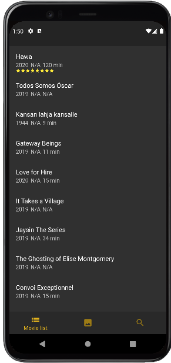
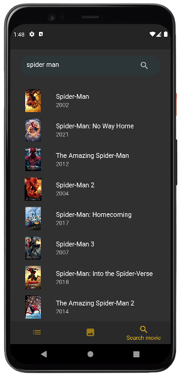
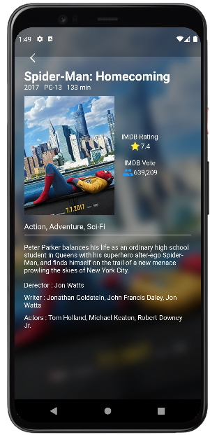

# Moviea Search App

It is a mobile app both for android and ios platfrom made by Flutter.
It's a Movie search app where user can search for movies and get movies informations.


## Features

- Search movies
- get movie lists as text
- get movies list as banner
- get any movie details(actors names, imdb rating, duration, release date etc)

## Tech Stack

**Client:** Flutter

**Server:** OMDB API

## Screenshots

MOVIE TEXT LIST


MOVIE BANNER LIST


Search for Movie


Movie Details


## Installation

### Step 1

Download [Flutter sdk](https://docs.flutter.dev/get-started/install)  
Download [Android Studio](https://developer.android.com/studio?gclid=Cj0KCQjw_viWBhD8ARIsAH1mCd4KYgq3igEpLzVa38kABX_aKT9ilh5RBvAfx2sQcq-DF3pVnYhrT_oaAnGDEALw_wcB&gclsrc=aw.ds#downloads)

### Step 2

Set up enviroment veriables

### Step 3

Run Flutter Doctor to your command prompyt

```bash
flutter Doctor
```

### Step 4

Now you need [OMDB_API_KEY](https://www.omdbapi.com/apikey.aspx) to run this app.
Use your own api key and set it in lib/api/api_key.dart

```
String myApikKey = "YOUR_API_KEY_HERE"
```

### 5

You are good to go now! Run your app in Vs code by **Run > Start Debugging or press f5**

## Support

For support, email dipta35-2707@diu.edu.bd
